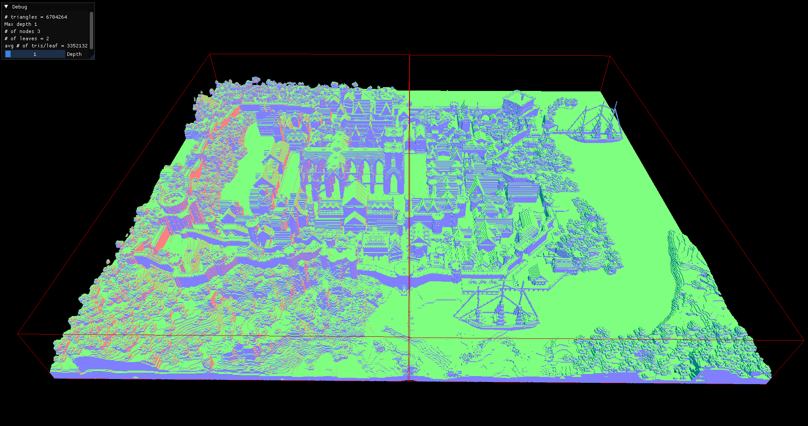

# BVH Visualizer

A simple C++/OpenGL application playing around with Bounding Volume Hierarchies (BVH). Load a 3D model (`.obj` format) and visualize the BVH structure at different depth levels.

## Features

- Load `.obj` model
- Visualize BVH construction
- Adjust BVH depth to see different levels of the hierarchy

## Example Visualizations

| Depth 1 | Depth 8 | Depth 16 |
|---------|---------|----------|
|  |  |  |

## Controls

- **WASD**: Move
- **RMB**: Look around
- **L-SHIFT/R-SHIFT**: Move up and down

## TODO

- [ ] SAH-based BVH
- [ ] Find other variants and add to this list.